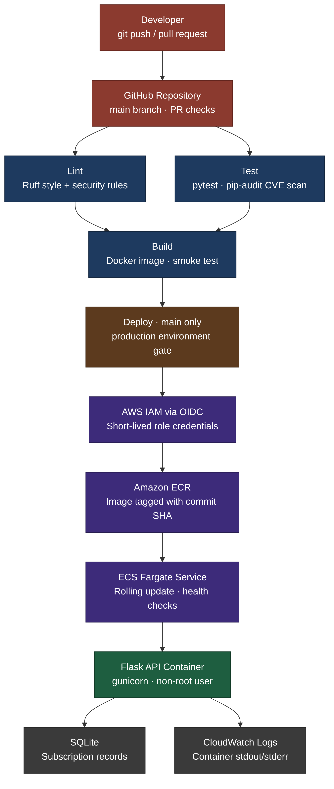

# Containerized Subscription Tracker with Automated CI/CD

## What This Builds
A Flask REST API for tracking recurring subscriptions, packaged in Docker and shipped by a GitHub Actions pipeline that
1. Lints the code (style + security rules)
2. Runs unit tests and a dependency CVE scan
3. Builds and smoke-tests the Docker image
4. Deploys to AWS ECS Fargate

With the goal of zero manual steps from `git push` to production

## Pipeline Flow
Lint + Test (parallel) → Build → Deploy (ECR → ECS Fargate)

## Prerequisites
- Python 3.12
- Docker
- GitHub repo (Actions enabled)
- AWS account (only for live deploy)

## Quick Start
1. Clone the repo
2. pip install -r requirements-dev.txt
3. pytest
4. docker build -t subscription-tracker .
5. docker run -p 8000:8000 subscription-tracker
6. curl localhost:8000/health
7. Push to GitHub and watch the Actions tab

## Example Request
```
curl -X POST localhost:8000/subscriptions \
  -H "Content-Type: application/json" \
  -d '{"name":"Netflix","cost":15.49,"billing_cycle":"monthly","renewal_date":"2026-11-01"}'
```

## Enabling Live Deploy
The deploy job runs in stub mode until you set these repo variables:
- `AWS_DEPLOY_ENABLED` = `true`
- `AWS_ROLE_ARN` = IAM role trusted for GitHub OIDC

Then create the ECR repo, ECS cluster, and ECS service named in `.github/workflows/ci-cd.yml`, and fill in `<ACCOUNT_ID>` in `deploy/task-definition.json`

## NIST 800-53 Control Mapping
See nist.md in docs/

## Architecture


See architecture.md in docs/ for more information

## Cost
Free in stub mode (GitHub Actions is free for public repos). Live deploy runs on ECS Fargate, which is billed per task-hour.

## Production Considerations
- Replace SQLite with RDS or DynamoDB
- Require reviewers on the `production` environment
- Add container image scanning and signing
- Put an ALB with HTTPS in front of the service
